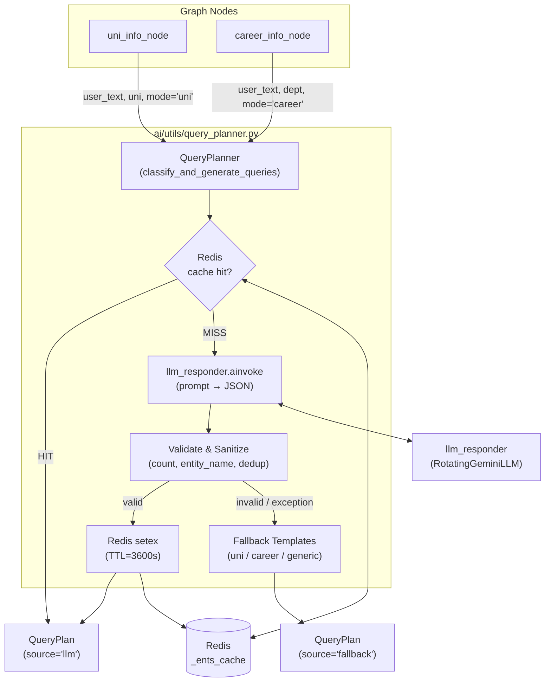

# Design Document: LLM Dynamic Query Generator

## Overview

Bu tasarım, `uni_info_node` ve `career_info_node` bileşenlerindeki sabit anahtar kelime listelerine ve şablon tabanlı sorgu üretimine dayalı kırılgan yaklaşımı kaldırarak yerine LLM güdümlü dinamik bir sınıflandırma ve sorgu üretim bileşeni getirir.

Yeni paylaşımlı bileşen `QueryPlanner`, tek bir LLM çağrısında hem kullanıcının niyetini sınıflandırır (`is_specific`) hem de web araması için kullanılmaya hazır sorgular üretir. Sonuçlar Redis önbelleğinde (TTL 3600 s) tutulur; LLM çağrısı herhangi bir nedenle başarısız olursa deterministic fallback şablonları devreye girer. Bu sayede `_build_uni_queries`, `_UNI_TOPIC_KEYWORDS`, `_detect_career_specificity` ve tüm sinyal listeleri (`_COMPANY_SIGNALS`, `_POSITION_SIGNALS`, `_GEO_JOB_SIGNALS`, `_TECH_SIGNALS`, `_EVAL_SIGNALS`) kaldırılır.

---

## Architecture

Aşağıdaki diyagram bileşenler arasındaki veri akışını göstermektedir.



### Temel Tasarım Kararları

| Karar | Gerekçe |
|-------|---------|
| Tek LLM çağrısında hem sınıflandırma hem sorgu üretimi | Gecikmeyi minimize eder; `_detect_career_specificity` regex mantığından daha doğru niyeti yakalar |
| Constructor injection (`llm_responder`, `_ents_cache`) | Test edilebilirliği garanti eder; mock geçilebilir bağımlılıklar |
| Redis önbellekleme (TTL 3600 s) | Aynı `(user_text, entity_name, mode)` için tekrarlanan LLM çağrılarını önler |
| Deterministic fallback | LLM/Redis arızasında mevcut node davranışı korunur, hizmet kesintisi olmaz |
| Türkçe prompt + JSON output schema | Gemini'nin Türkçe sorgular üretmesini garantiler; yapılandırılmış çıktı ayrıştırmayı kolaylaştırır |

---

## Components and Interfaces

### `QueryPlan` Dataclass

```python
# ai/utils/query_planner.py
from dataclasses import dataclass
from typing import Literal

@dataclass
class QueryPlan:
    is_specific: bool
    queries: list[str]          # 1 ≤ len ≤ 5, her eleman non-empty, her eleman ≤ 500 karakter
    source: Literal["llm", "fallback"]
```

> **Not:** `core/schemas.py` içindeki `QueryPlan` deep-search planlama amacıyla kullanılan tamamen farklı bir yapıdır. `ai/utils/query_planner.py` içindeki bu sınıf bağımsız, basit bir dataclass'tır ve Pydantic gerektirmez.

### `QueryPlanner` Sınıfı

```python
class QueryPlanner:
    def __init__(
        self,
        llm_responder,          # RotatingGeminiLLM instance (or any .ainvoke-compatible mock)
        cache=None,             # Redis client or None (_ents_cache from utils.redis_cache)
    ) -> None: ...

    async def classify_and_generate_queries(
        self,
        user_text: str,
        entity_name: str,
        mode: Literal["uni", "career"],
    ) -> QueryPlan: ...

    # Internal helpers:
    def _cache_key(self, user_text: str, entity_name: str, mode: str) -> str: ...
    def _build_prompt(self, user_text: str, entity_name: str, mode: str) -> str: ...
    def _parse_llm_response(self, raw: str) -> dict | None: ...
    def _validate_queries(self, queries: list, entity_name: str) -> list[str] | None: ...
    def _fallback(self, entity_name: str, mode: str, reason: str) -> QueryPlan: ...
```

#### Modül düzeyinde singleton

```python
# ai/utils/query_planner.py — modül sonu
from models import llm_responder as _llm_responder
from utils.redis_cache import _ents_cache as _redis_cache

query_planner = QueryPlanner(llm_responder=_llm_responder, cache=_redis_cache)
```

Node'lar bu singleton'u import eder:

```python
from utils.query_planner import query_planner
plan = await query_planner.classify_and_generate_queries(...)
```

---

## Data Models

### `classify_and_generate_queries` Akış Diyagramı

```mermaid
flowchart TD
    A["classify_and_generate_queries(user_text, entity_name, mode)"] --> B{mode geçerli mi?\n'uni' | 'career'}
    B -- hayır --> FB_MODE["_fallback(entity_name, mode='invalid', ...)"]
    B -- evet --> C["cache_key = _cache_key(user_text, entity_name, mode)"]
    C --> D{Redis\nget(cache_key)}
    D -- "HIT + valid JSON" --> E["JSON → QueryPlan(source='llm')\nreturn"]
    D -- "MISS veya bozuk" --> F["_build_prompt(user_text, entity_name, mode)"]
    F --> G["llm_responder.ainvoke(prompt)"]
    G -- "exception" --> FB_EXC["_fallback(entity_name, mode, reason=str(exc))"]
    G -- "yanıt" --> H["_parse_llm_response(raw)"]
    H -- "None (parse hatası)" --> FB_PARSE["_fallback(entity_name, mode, 'parse error')"]
    H -- "dict" --> I["_validate_queries(queries, entity_name)"]
    I -- "None (count/dedup fail)" --> FB_VAL["_fallback(entity_name, mode, 'validation error')"]
    I -- "list[str]" --> J["QueryPlan(is_specific=..., queries=..., source='llm')"]
    J --> K["Redis setex(cache_key, 3600, json_dump)"]
    K --> L["return QueryPlan"]
```

### Cache Key

```python
import hashlib

def _cache_key(self, user_text: str, entity_name: str, mode: str) -> str:
    digest = hashlib.sha256((user_text + entity_name).encode()).hexdigest()[:16]
    return f"ai:query_plan:{mode}:{digest}"
```

Bu fonksiyon saf bir fonksiyon olup aynı girdiler için daima aynı anahtarı üretir.

### LLM Prompt Yapısı

```python
def _build_prompt(self, user_text: str, entity_name: str, mode: str) -> str:
    if mode == "uni":
        context_hint = (
            "kampüs olanakları, burs ve harç bilgisi, "
            "taban puan ve kontenjan, öğrenci yorumları, akademik kadro"
        )
    else:  # career
        context_hint = (
            "müfredat ve ders içerikleri, "
            "mezun maaş ve kariyer yolları, YÖK istihdam istatistikleri"
        )

    return f"""Sen bir Türkçe web arama sorgusu uzmanısın.

Kullanıcı sorusu: "{user_text}"
Araştırılan varlık: "{entity_name}"
Araştırma bağlamı: {context_hint}

Görevin:
1. Kullanıcı sorusunun SPESİFİK mi (belirli bir konu/durum sorgusu) yoksa GENEL mi (genel bilgi/analiz) olduğunu belirle.
2. Bu soruyu yanıtlamak için kullanılabilecek 3 ile 5 arasında Türkçe web arama sorgusu üret.
3. Her sorgu "{entity_name}" ifadesini içermeli.
4. Sorgular birbirinden farklı olmalı ve farklı bilgi kaynaklarını hedeflemelidir.

SADECE aşağıdaki JSON formatında yanıt ver, başka hiçbir şey yazma:
{{"is_specific": true, "queries": ["sorgu1", "sorgu2", "sorgu3"]}}

Kural: is_specific=true ise kullanıcı belirli bir konuyu soruyor, is_specific=false ise genel bilgi/analiz istiyor.
"""
```

### Fallback Şablonları

```python
def _fallback(self, entity_name: str, mode: str, reason: str) -> QueryPlan:
    print(f"[QUERY_PLANNER] ⚠️ Fallback — sebep: {reason}")
    if mode == "uni":
        queries = [
            f"{entity_name} genel bilgi akademik kadro",
            f"{entity_name} öğrenci yorumları",
            f"{entity_name} burs ücret 2024 2025",
            f"{entity_name} kariyer mezun iş imkânları",
        ]
        return QueryPlan(is_specific=False, queries=queries, source="fallback")
    elif mode == "career":
        queries = [
            f"{entity_name} bölümü müfredat ders içerikleri",
            f"{entity_name} mezunu kariyer maaş iş ilanları",
            f"{entity_name} istihdam oranı YÖK istatistik",
        ]
        return QueryPlan(is_specific=False, queries=queries, source="fallback")
    else:
        return QueryPlan(
            is_specific=False,
            queries=[f"{entity_name} hakkında bilgi"],
            source="fallback",
        )
```

### `_validate_queries` Mantığı

Aşağıdaki adımları sırasıyla uygular:

1. `queries` bir `list` değilse veya `len(queries)` 3'ten az ya da 5'ten fazlaysa → `None` döndür.
2. Her sorgudan boş string'leri filtrele.
3. Her sorgunun başında `entity_name` (case-insensitive) yoksa başına `entity_name + " "` ekle.
4. Her sorguyu 500 karakterle kırp.
5. Deduplication: case-insensitive karşılaştırmayla benzersiz sorguları tut.
6. Deduplication sonrası `len(queries) < 3` ise → `None` döndür (fallback tetiklenir).
7. Geçerli `list[str]` döndür.

---

## Integration Changes

### `uni_info_node` Değişiklikleri

**Kaldırılacaklar:**
- `_UNI_TOPIC_KEYWORDS` listesi
- `_build_uni_queries` fonksiyonu
- `is_specific` hesaplayan keyword tarama bloğu
- `detected_keyword` çıkarımı

**Eklenecekler:**

```python
from utils.query_planner import query_planner

# uni_info_node içinde, uni tespit edildikten sonra:
try:
    plan = await query_planner.classify_and_generate_queries(
        user_text=user_text,
        entity_name=uni,
        mode="uni",
    )
except Exception:
    return {"messages": [AIMessage(content="Bu üniversite için şu an arama yapamıyorum, lütfen tekrar dene.")]}

if not plan.queries:
    return {"messages": [AIMessage(content="Bu üniversite için şu an arama yapamıyorum, lütfen tekrar dene.")]}

is_specific = plan.is_specific
queries = plan.queries

# Cache kontrolü (is_specific=False ise)
if not is_specific:
    cache_key = _uni_info_cache_key(uni)
    cached = _load_uni_info_cache(cache_key)
    if cached:
        return {"messages": [AIMessage(content=cached)]}
else:
    cache_key = None

# human_content sinyal satırı:
signal = (
    "Soru tipi: SPESİFİK — sadece sorulan konuyu cevapla, genel üniversite analizi yapma"
    if is_specific
    else "Soru tipi: GENEL — tam üniversite analizi yap"
)
```

### `career_info_node` Değişiklikleri

**Kaldırılacaklar:**
- `_detect_career_specificity` fonksiyonu
- `_COMPANY_SIGNALS`, `_POSITION_SIGNALS`, `_GEO_JOB_SIGNALS`, `_TECH_SIGNALS`, `_EVAL_SIGNALS` listeleri
- `_COMPILED_CAREER_SIGNALS`, `_ALL_CAREER_SIGNALS`, `_GENERAL_QUESTION_PATTERN`
- `is_career_specific = _detect_career_specificity(user_text)` çağrısı

**Eklenecekler:**

```python
from utils.query_planner import query_planner

# dept boşsa QueryPlanner çağrılmadan açıklama mesajı döndür (Requirement 6.7):
if not dept:
    # is_career_specific'i belirleyemiyoruz, genel açıklama döndür
    return {"messages": [AIMessage(content=(
        "Hangi bölüm veya alanı araştırmak istediğini belirtir misin? "
        "(Örn. 'Bilgisayar Mühendisliği', 'Psikoloji', 'Hukuk')"
    ))]}

# QueryPlanner çağrısı:
plan = await query_planner.classify_and_generate_queries(
    user_text=user_text,
    entity_name=dept,
    mode="career",
)
is_career_specific = plan.is_specific
queries = plan.queries

# Yol A — Spesifik, dept mevcut ama sorgu yoksa açıklama
# (bu durum pratikte fallback da 3 sorgu ürettiğinden nadiren oluşur)

# Sinyal:
signal = (
    "Soru tipi: SPESİFİK — sadece sorulan konuyu cevapla, tam şablon doldurma"
    if is_career_specific
    else "Soru tipi: GENEL — tam kariyer analizi yap"
)
```

> **Davranış korunması:** `dept=""` durumunda `classify_and_generate_queries` çağrılmaz, mevcut Yol A/B açıklama mesajları aynen korunur (Requirement 6.6, 6.7).

---

## Correctness Properties

*A property is a characteristic or behavior that should hold true across all valid executions of a system — essentially, a formal statement about what the system should do. Properties serve as the bridge between human-readable specifications and machine-verifiable correctness guarantees.*

### Property 1: `classify_and_generate_queries` asla exception fırlatmaz

*For any* `user_text` (min 1 karakter), `entity_name` (min 1 karakter) ve `mode ∈ {"uni", "career"}` kombinasyonu için, `classify_and_generate_queries` her zaman bir `QueryPlan` nesnesi döndürmeli ve asla exception iletmemelidir — LLM veya Redis çağrısının sonucundan bağımsız olarak.

**Validates: Requirements 8.3, 8.4**

---

### Property 2: `QueryPlan.queries` invariantı

*For any* `classify_and_generate_queries` çağrısının döndürdüğü `QueryPlan`'da, `queries` listesi her zaman 1 ile 5 arasında eleman içermeli ve her eleman en az 1 karakter uzunluğunda non-empty bir string olmalıdır. Bu değişmez LLM yolundan bağımsız, her koşulda (`source="llm"` veya `source="fallback"`) geçerlidir.

**Validates: Requirements 1.2, 1.4, 1.5, 1.6, 7.1, 8.5**

---

### Property 3: Geçersiz mod → her zaman fallback

*For any* string değeri `mode` ki `mode ∉ {"uni", "career"}`, `classify_and_generate_queries` çağrısı LLM çağrısı yapmadan `source="fallback"` içeren bir `QueryPlan` döndürmelidir.

**Validates: Requirements 2.8, 4.5**

---

### Property 4: LLM exception → her zaman fallback

*For any* LLM çağrısının fırlattığı exception türü için (ağ hatası, timeout, kimlik doğrulama, `ValueError`, `RuntimeError` vb.), `classify_and_generate_queries` exception'ı çağırana iletmeden `source="fallback"` döndürmelidir.

**Validates: Requirements 4.1, 8.3**

---

### Property 5: Geçersiz LLM yanıtı → fallback

*For any* LLM'in döndürdüğü ham string değeri ki JSON parse edilemiyor ya da `is_specific`/`queries` alanlarından biri eksik ya da `queries` listesi 3'ten az veya 5'ten fazla elemanlıysa, sonuç `source="fallback"` olan bir `QueryPlan` olmalıdır.

**Validates: Requirements 2.9, 4.2, 7.2**

---

### Property 6: entity_name sorgularda her zaman mevcut

*For any* `entity_name` ve `classify_and_generate_queries`'nin döndürdüğü `QueryPlan.queries` içindeki her sorgu için, o sorgu `entity_name`'i (büyük/küçük harf duyarsız) içermelidir. LLM bunu atlarsa `entity_name + " "` prepend yapılarak düzeltilmelidir.

**Validates: Requirements 2.6, 7.3**

---

### Property 7: Cache determinism (idempotence)

*For any* `(user_text, entity_name, mode)` kombinasyonu için cache anahtarı oluşturma fonksiyonu iki kez çağrıldığında aynı anahtarı üretmelidir. Farklı inputlar (herhangi bir alanda değişiklik) farklı anahtarlar üretmelidir.

**Validates: Requirements 3.1**

---

### Property 8: Cache hit → LLM çağrılmaz

*For any* `(user_text, entity_name, mode)` kombinasyonu için Redis'te geçerli bir `QueryPlan` mevcut olduğunda, `classify_and_generate_queries` çağrısı `llm_responder.ainvoke`'u çağırmadan cache'teki değeri döndürmelidir. Döndürülen `QueryPlan`'ın `queries` ve `source` alanları, ilk çağrıdaki değerlerle özdeş olmalıdır.

**Validates: Requirements 3.2, 8.6**

---

### Property 9: Fallback sorgular entity_name içerir

*For any* `entity_name` değeri için `mode="uni"` veya `mode="career"` modundaki fallback, üretilen her sorgu `entity_name`'i içermeli ve toplam sorgu sayısı 1 ile 5 arasında olmalıdır. `mode="uni"` en az 3 sorgu, `mode="career"` tam olarak 3 sorgu üretmelidir.

**Validates: Requirements 4.3, 4.4**

---

### Property 10: Prompt, tüm input değerlerini içerir

*For any* `(user_text, entity_name, mode)` girdisi için `_build_prompt` tarafından üretilen prompt string'i, `user_text`, `entity_name` ve `mode`'a özgü bağlam talimatlarını içermelidir; LLM bu string'i almalıdır.

**Validates: Requirements 2.1, 2.3, 2.4**

---

### Property 11: Deduplication sonrası en az 3 sorgu yoksa fallback

*For any* LLM çağrısının döndürdüğü sorgu listesi için, case-insensitive deduplication sonrasında 3'ten az benzersiz sorgu kalıyorsa sonuç `source="fallback"` olmalıdır; aksi halde döndürülen listede hiçbir sorgunun case-insensitive tekrarı bulunmamalıdır.

**Validates: Requirements 7.4**

---

## Error Handling

### LLM Hata Yönetimi

| Hata Türü | Davranış |
|-----------|----------|
| `llm_responder.ainvoke` exception | `except Exception as e` yakalanır; `_fallback(entity_name, mode, str(e))` çağrılır |
| LLM geçersiz JSON döndürür | `json.loads` try/except ile yakalanır; fallback tetiklenir |
| LLM eksik alan döndürür | `_parse_llm_response` `None` döndürür; fallback tetiklenir |
| LLM yanlış sorgu sayısı döndürür | `_validate_queries` `None` döndürür; fallback tetiklenir |

### Redis Hata Yönetimi

| Hata Türü | Davranış |
|-----------|----------|
| `_ents_cache` is `None` | Cache adımı tamamen atlanır, LLM çağrısına devam |
| Redis `get()` exception | `except Exception` sessizce yakalanır, LLM çağrısına devam |
| Redis bozuk veri (parse hatası) | `except Exception` sessizce yakalanır, LLM çağrısına devam |
| Redis `setex()` exception | `except Exception` sessizce yakalanır, döndürülen QueryPlan etkilenmez |

Tüm hata yollarında `[QUERY_PLANNER] ⚠️ Fallback — sebep: <hata mesajı>` formatında log basılır.

### Node Düzeyi Hata Yönetimi

- `uni_info_node`: `classify_and_generate_queries` exception fırlatırsa (teorik, Property 1 gereği asla olmamalı) veya `plan.queries` boşsa `"Bu üniversite için şu an arama yapamıyorum, lütfen tekrar dene."` döner.
- `career_info_node`: `dept` boşken `classify_and_generate_queries` hiç çağrılmaz; mevcut açıklama mesajları korunur.

---

## Testing Strategy

### Araç Seçimi

**Python + Hypothesis** — proje zaten Hypothesis kullanmaktadır (`ai/.hypothesis/` dizini ve `test_uni_info.py`, `test_career_info.py` içindeki `@given` testleri). `QueryPlanner` için de aynı kütüphane kullanılacaktır.

### Çift Katmanlı Test Yaklaşımı

**Unit / Örnek Testler** belirli davranışları ve hata yollarını doğrular:
- `mode="uni"` fallback'te 4 spesifik sorgu şablonu
- `mode="career"` fallback'te tam olarak 3 spesifik sorgu şablonu
- Geçerli LLM JSON'dan `source="llm"` üretimi
- `_validate_queries` edge case'leri (boş string, 500+ karakter)
- Prompt'un Türkçe talimatlar içerdiği

**Property Testler** evrensel özellikleri geniş girdi uzayında doğrular (min 100 iterasyon):
- Her property'nin tasarım belgesiyle anotasyonu: `# Feature: llm-dynamic-query-generator, Property N: <metin>`
- Her property testi ayrı bir `@given` fonksiyonu
- Mock stratejisi: `llm_responder.ainvoke` ve `_ents_cache` constructor injection yoluyla `AsyncMock`/`MagicMock` ile

### Test Dosya Yapısı

```
ai/tests/
└── test_query_planner.py          # Tüm QueryPlanner property ve unit testleri
```

### Property Test Örnekleri (Şema)

```python
# Property 1: Never raises
@settings(max_examples=100)
@given(
    user_text=st.text(min_size=1, max_size=200),
    entity_name=st.text(min_size=1, max_size=100),
    mode=st.sampled_from(["uni", "career"]),
)
async def test_property1_never_raises(user_text, entity_name, mode):
    """
    # Feature: llm-dynamic-query-generator, Property 1: classify_and_generate_queries never raises
    """
    mock_llm = AsyncMock(side_effect=RuntimeError("LLM down"))
    planner = QueryPlanner(llm_responder=mock_llm, cache=None)
    result = await planner.classify_and_generate_queries(user_text, entity_name, mode)
    assert isinstance(result, QueryPlan)

# Property 2: queries invariant
@settings(max_examples=100)
@given(
    user_text=st.text(min_size=1, max_size=200),
    entity_name=st.text(min_size=1, max_size=100),
    mode=st.sampled_from(["uni", "career"]),
)
async def test_property2_queries_invariant(user_text, entity_name, mode):
    """
    # Feature: llm-dynamic-query-generator, Property 2: QueryPlan.queries always 1-5 non-empty strings
    """
    ...
```

### Entegrasyon Testi Değerlendirmesi

`uni_info_node` ve `career_info_node`'un `QueryPlanner`'ı doğru argümanlarla çağırdığını doğrulayan testler (`test_uni_info.py`, `test_career_info.py`'e eklenecek) entegrasyon testleri olarak sınıflandırılır — tek bir temsilci örnekle yeterlidir.

### PBT Yapılandırması

- **Min iterasyon:** 100 (`@settings(max_examples=100)`)
- **Hypothesis profile:** `ci` profili mevcutsa kullanılabilir, yoksa default
- **Test koşturucu:** `pytest` (mevcut proje standardı)
- **Mock isolation:** `QueryPlanner(llm_responder=mock, cache=mock_cache)` — gerçek Redis/LLM bağlantısı yok
